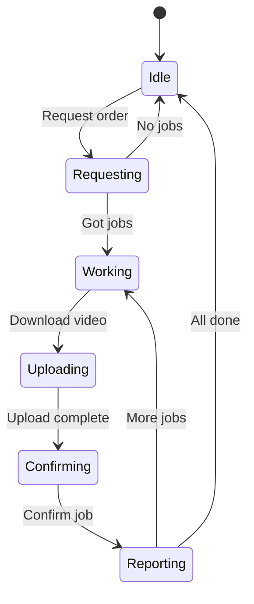
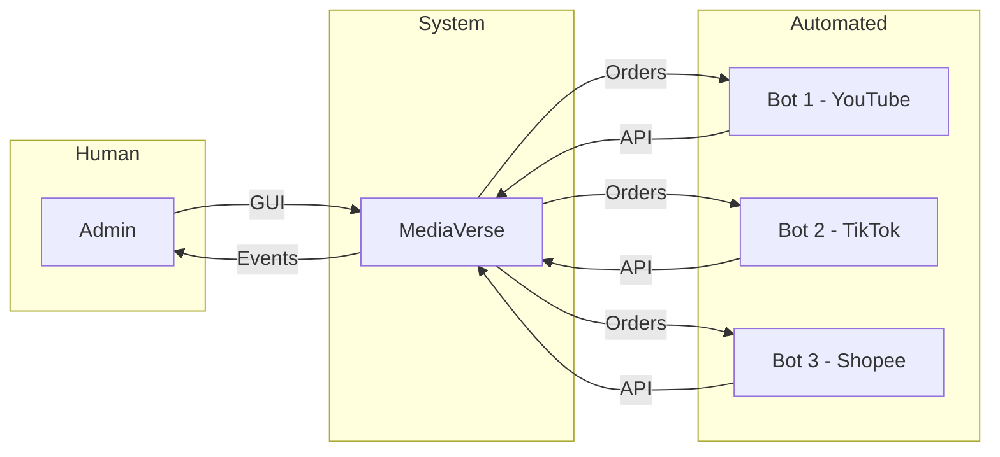

# MediaVerse Actors

## Primary Actors

### 1. Admin (Human User)

| Attribute | Value |
|-----------|-------|
| **Type** | Human |
| **Interface** | Desktop GUI (PySide6) |
| **Goals** | จัดการ Products, ติดตาม Orders, ควบคุม Bots |

**Responsibilities:**
- Import product folders
- Monitor dashboard
- Manage clients (bots)
- View order history
- Configure system settings

---

### 2. Bot (Browser Plugin)

| Attribute | Value |
|-----------|-------|
| **Type** | Automated Software Agent |
| **Interface** | REST API (FastAPI) |
| **Goals** | Upload videos to platforms automatically |

**Responsibilities:**
- Request orders from API (Just-in-Time)
- Download video files
- Upload to target platform
- Report success/failure

**Bot States:**

---

### 3. System (Internal Actor)

| Attribute | Value |
|-----------|-------|
| **Type** | Software System |
| **Interface** | EventBus, MessageOrchestrator |
| **Goals** | Route messages, handle events |

**Components Acting as System:**
- EventBus: Pub/Sub messaging
- MessageOrchestrator: Request/Response validation
- LogOrchestrator: Logging
- ErrorOrchestrator: Error handling

---

## Actor Interactions

---

## Actor Permissions Matrix

| Action | Admin | Bot | System |
|--------|-------|-----|--------|
| Import Products | ✅ | ❌ | ❌ |
| View Dashboard | ✅ | ❌ | ❌ |
| Create Orders | ❌ | ✅ | ❌ |
| Download Videos | ❌ | ✅ | ❌ |
| Report Status | ❌ | ✅ | ❌ |
| Publish Events | ❌ | ❌ | ✅ |
| Route Messages | ❌ | ❌ | ✅ |
| Add Clients | ✅ | ❌ | ❌ |
| Change Settings | ✅ | ❌ | ❌ |
