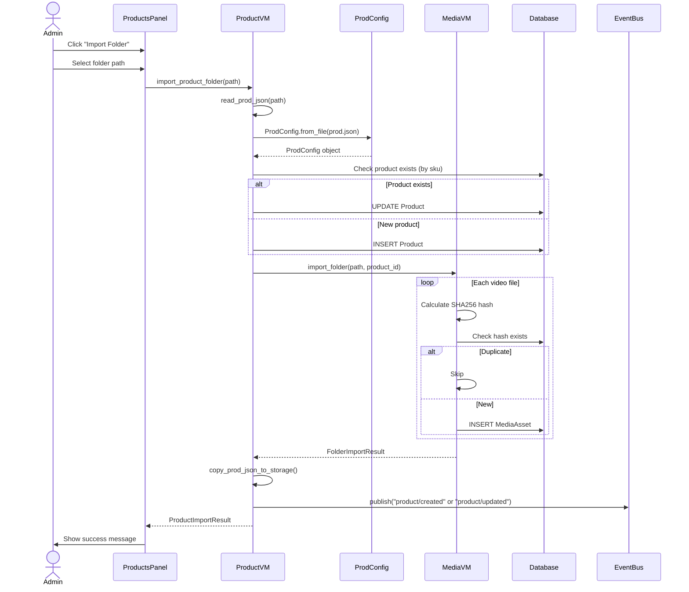
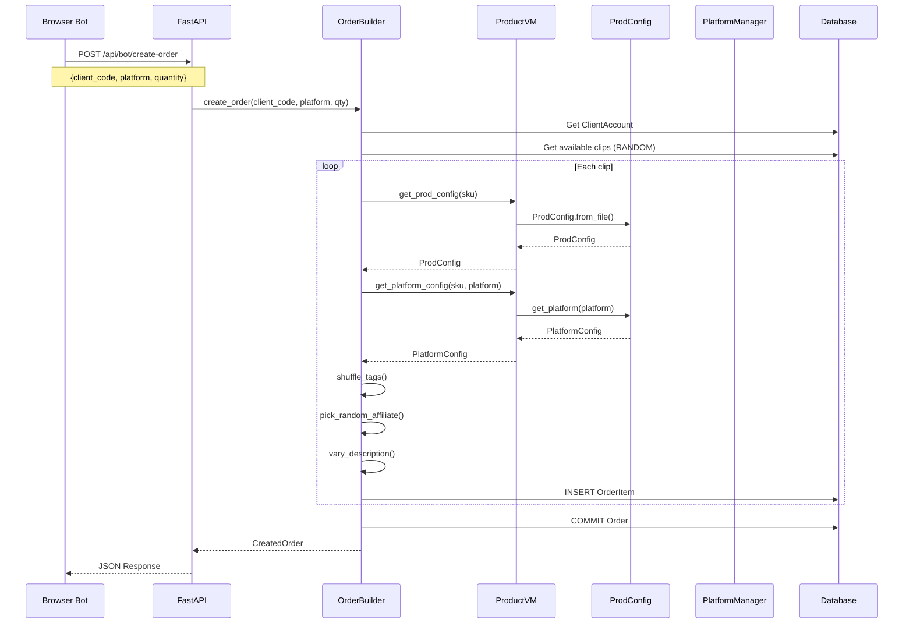
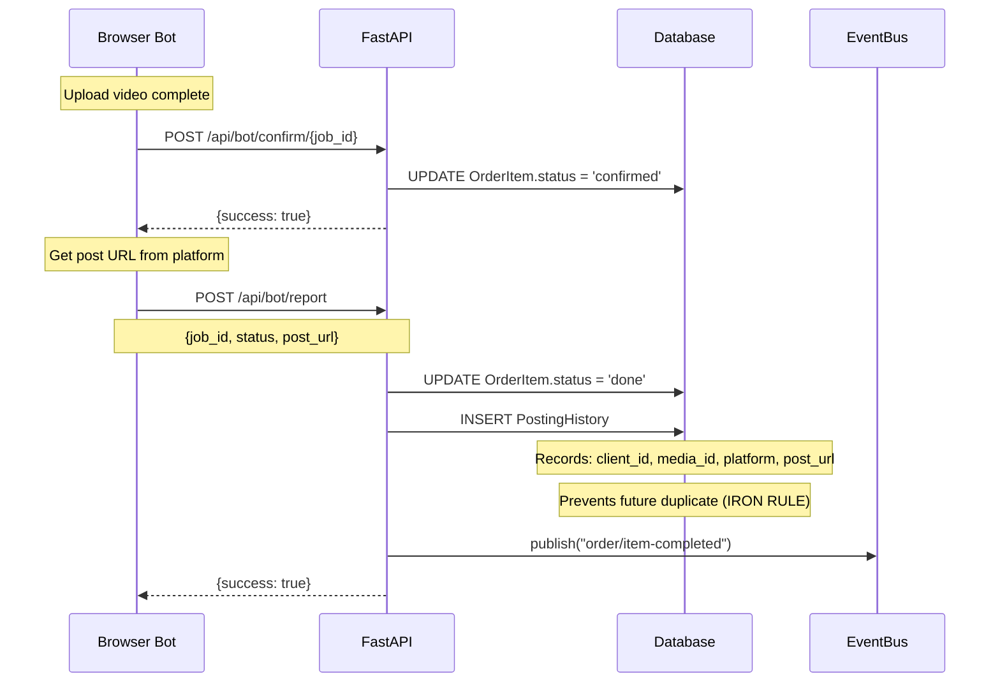
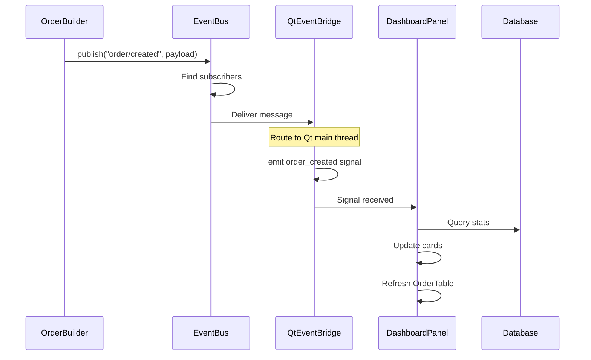
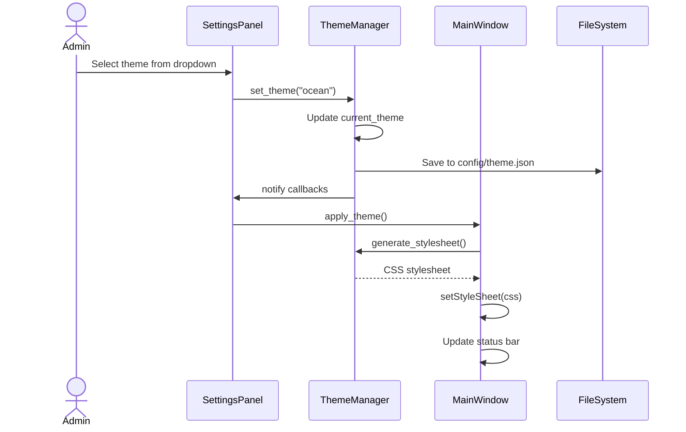

# MediaVerse Sequence Diagrams

## Sequence 1: Product Import

---

## Sequence 2: Bot Create Order

---

## Sequence 3: Bot Complete Job

---

## Sequence 4: Real-time GUI Update

---

## Sequence 5: Theme Change

