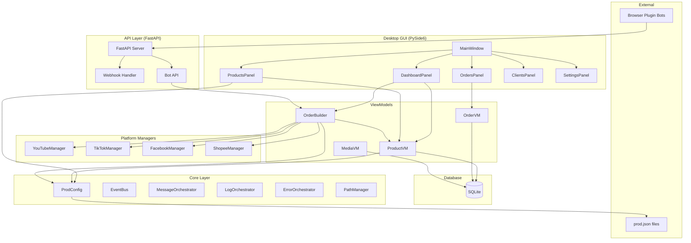
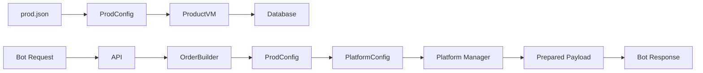

# MediaVerse System Design

## Overview

MediaVerse เป็นระบบจัดการและกระจายวิดีโอไปยัง Multi-Platform (YouTube, TikTok, Facebook, Shopee, Lazada) โดยใช้ Bot อัตโนมัติ

---

## System Architecture

---

## Actors

| Actor | Description |
|-------|-------------|
| **Admin** | ใช้ Desktop GUI จัดการ Products, Orders, Clients |
| **Bot (Browser Plugin)** | ทำงานอัตโนมัติบน Browser เรียก API เพื่อขอ Jobs |
| **System** | MessageOrchestrator จัดการ routing ภายใน |

---

## Data Flow

---

## Key Classes

### Core Orchestrators

| Class | Responsibility | Lines |
|-------|----------------|-------|
| `EventBus` | Pub/Sub messaging (MQTT-like) | ~150 |
| `MessageOrchestrator` | Validate, route, envelope | ~200 |
| `QueueOrchestrator` | Priority queue, retry, dead letter | ~270 |
| `LogOrchestrator` | Centralized logging | ~150 |
| `ErrorOrchestrator` | Error handling | ~200 |

### Engines

| Class | Responsibility | Lines |
|-------|----------------|-------|
| `BaseEngine` | Abstract base (Template Method) | ~120 |
| `ProcessEngine` | Thread pool, job execution | ~210 |
| `MonitorEngine` | Metrics, health checks | ~280 |
| `InsightEngine` | **AI data collection, patterns** | ~380 |

### ViewModels

| Class | Responsibility |
|-------|----------------|
| `ProductVM` | จัดการ Products + import folder |
| `OrderVM` | จัดการ Orders + IRON RULES |
| `MediaVM` | จัดการ Media files + SHA256 dedup |
| `OrderBuilder` | สร้าง Orders พร้อม Anti-Bot-Detection |

### Platform Managers

| Class | Responsibility |
|-------|----------------|
| `BasePlatformManager` | Abstract base (Strategy Pattern) |
| `YouTubeManager` | YouTube/Shorts specific logic |
| `TikTokManager` | TikTok specific logic |
| `FacebookManager` | Facebook/Reels specific logic |
| `ShopeeManager` | Shopee specific logic |

---

## Design Patterns Used

| Pattern | Usage |
|---------|-------|
| **Singleton** | EventBus, MessageOrchestrator, PathManager |
| **Strategy** | Platform Managers |
| **Factory** | `get_platform_manager()` |
| **Observer** | EventBus subscriptions |
| **MVVM** | ViewModels + GUI Panels |
| **Bridge** | ProdConfig (prod.json ↔ system) |

---

## Technology Stack

| Layer | Technology |
|-------|------------|
| Desktop GUI | PySide6 (Qt) |
| API Server | FastAPI + Uvicorn |
| Database | SQLite + SQLAlchemy |
| Build | PyInstaller + PyArmor |
| Testing | Pytest |
