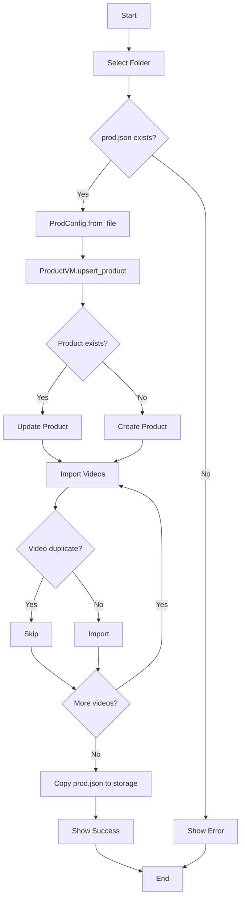
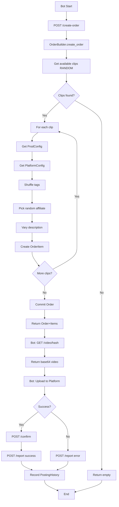
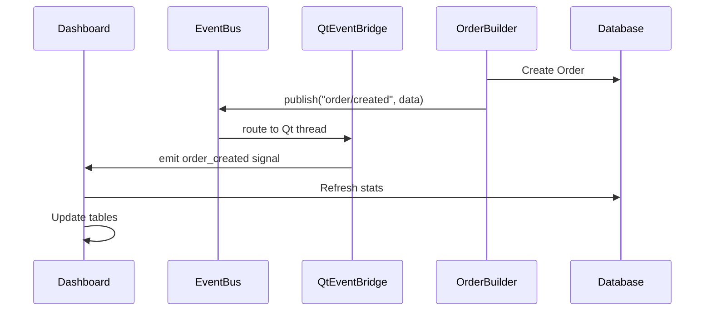
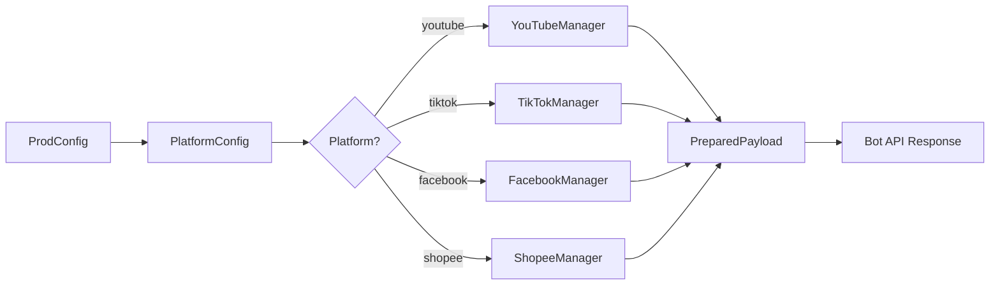
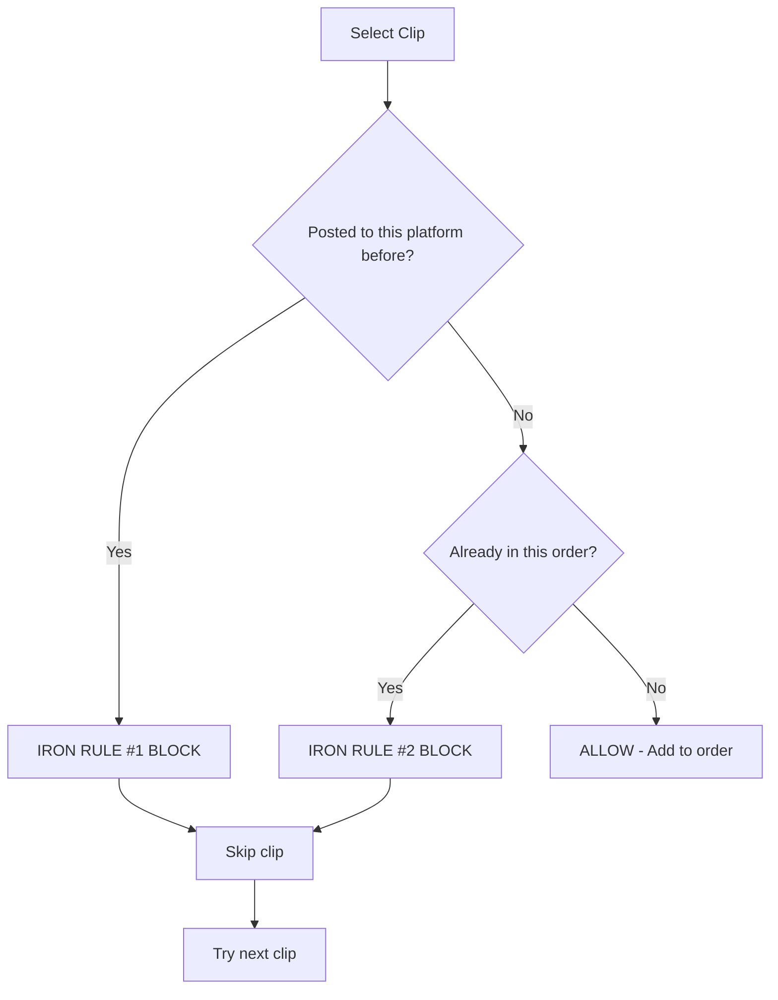

# MediaVerse Workflows

## Workflow 1: Product Import

---

## Workflow 2: Bot Order Flow

---

## Workflow 3: Real-time Dashboard Update

---

## Workflow 4: Platform Payload Preparation

---

## Workflow 5: IRON RULES Check

